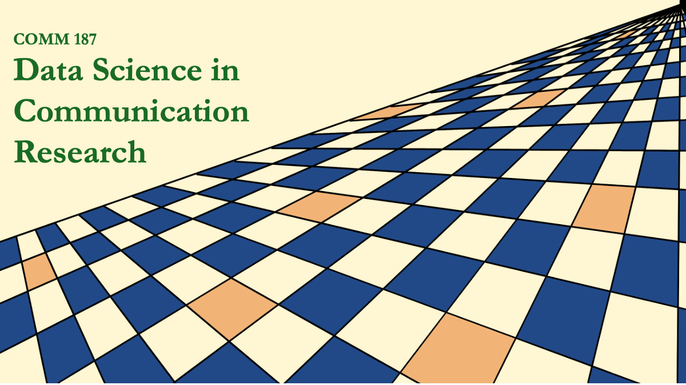

# COMM187 Data Science in Communication Research
Materials and Python notebooks for COMM 187 (160DS) Data Science in Communication Research offered at UC Santa Barbara.
Students enrolled in the class can access readings, syllabus, and other materials on Canvas.

**Winter 2026** \
**Tu 5 PM - 7:20 PM, ILP 2211**

**Instructors** \
Prof. Prateekshit "Kanu" Pandey \
TA: Kylie Woodman Falcione

## Course Aims and Outcomes
The aim of this course is to help you understand the core components and methodologies of data science research, critically think about the applications and utility of data science in communication research, and develop programming skills in Python to conduct beginner level data analysis and visualizations.

By the end of this course, you will be able to:

 - Identify and analyze the role of data in day-to-day life

 - Understand the meaning and application of machine learning and artificial intelligence

 - Critically analyze the ethics of data collection, development, storage, and analysis

 - Write computer programs in Python at a beginner level

 - Identify instances of effective data storytelling and spot misleading forms of data journalism in daily digital media

## Coding Lab
We will have an in-person "Coding Lab" where we will learn data analysis using Python programming language.

[**Week #2 Coding Lab**]()

[**Week #3 Coding Lab**]()

[**Week #4 Coding Lab**]()

[**Week #7 Coding Lab**]()

[**Week #8 Coding Lab**]()

[**Week #9 Coding Lab**]()

## Coding Assignments
One coding assignment will be due each week. These assignments will test the programming skills learnt and discussed in the week before.

[**Coding Assignment #1**]()

[**Coding Assignment #2**]()

[**Coding Assignment #3**]()

[**Coding Assignment #4**]()

[**Coding Assignment #5**]()

[**Coding Assignment #6**]()

[**Coding Assignment #7**]()

[**Coding Assignment #8**]()
